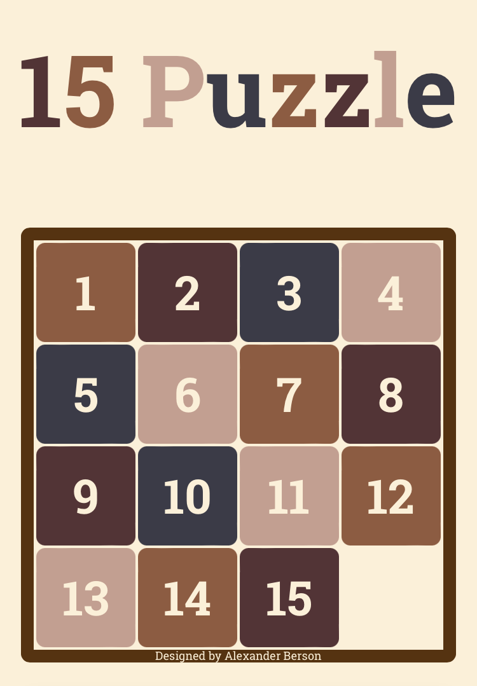

# 15 Puzzle

Arrange tiles in numerical sequence using the extra space in the grid to slide the numbered tiles.
You can try to solve [15 Puzzle online](https://alex-berson.github.io/15-puzzle/) or  

## Description

**15 Puzzle**, also called **Gem Puzzle,** **Boss Puzzle,** or **Mystic Square**, puzzle consisting of 15 tiles, numbered 1 through 15, which can be slid horizontally or vertically within a four-by-four grid that has one empty space among its 16 locations. The object of the puzzle is to arrange the tiles in numerical sequence using the extra space in the grid to slide the numbered tiles.

## Screenshot

  

## License

Copyright &copy; 2019-2021 Alexander Berson. This project is licensed under the [MIT license](LICENSE.txt "MIT License").

